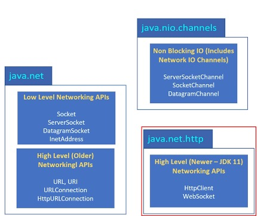

## Qu’est-ce que le réseautage et pourquoi est-il important ?

+ Wikipédia décrit Internet comme un système mondial de réseaux informatiques interconnectés.

+ Il s'agit d'un réseau de réseaux, composé de réseaux privés, publics, universitaires, commerciaux et gouvernementaux, dont certains sont locaux et d'autres mondiaux.

+ Internet offre une vaste gamme de ressources et de services d’information, comme nous le savons tous.

## Prise en charge de Java pour l'écriture de code réseau
+ Java prend en charge la mise en réseau depuis sa première version.

+ Comme beaucoup d'autres sujets de ce cours, le langage Java continue d'évoluer.

+ Dans cette section, je commencerai par le package java.net d'origine et les types qu'il fournit.

+ Cela inclut les types de programmation de bas niveau, qui fonctionnent avec des sockets et des adresses.

+ Il comprend également des types de niveau supérieur, qui masquent ou gèrent les détails du niveau de connexion.

## Les alternatives Java à java.net

+ J'utiliserai également cette section pour vous présenter de nouveaux changements intéressants.

+ Les canaux offrent un moyen beaucoup plus robuste de communiquer entre des appareils interconnectés, et il existe plusieurs canaux que nous pouvons utiliser pour les communications réseau.

+ De plus, `JDK11` a également vu l'inclusion du package `java.net.http`.

+ Cela inclut la prise en charge de `HTML 2.0`, ainsi que des modèles de création, pour créer des instances de types, spécifiquement utilisées pour la communication Internet.

+ De plus, ce package nous donne également le type `WebSocket`.

+ Contrairement aux clients `HTTP`, les WebSockets établissent des connexions persistantes entre le navigateur et le serveur, permettant une communication bidirectionnelle.

## Qu’est-ce que le réseautage ?

+ `Le réseautage` est le fondement des communications modernes.
+ `Un réseau` est un système d'ordinateurs et d'autres appareils connectés entre eux, afin qu'ils communiquent entre eux, pour échanger des données et partager des ressources.
+ `La mise en réseau` fait référence à la manière dont les ordinateurs connectés communiquent.
+ Cela peut être effectué via Internet ou via un réseau local, qui n’est qu’un ensemble d’appareils connectés ensemble en un seul emplacement physique.

## Pourquoi le réseautage est-il important dans le développement de logiciels ?

+ Raisons importantes pour le réseautage :

    + Communication de données, permettant aux applications d'échanger des données en temps réel, entre les utilisateurs et les systèmes.
    + Systèmes distribués, permettant aux applications d'être déployées sur de nombreux serveurs.
    + Fondamental pour Internet et le Cloud Computing.
    + Permet l'accès et le contrôle à distance aux systèmes distribués.
    + Permet la communication entre les applications, grâce à l'utilisation d'API et de services Web.

## Réseau privé (Intranet)

+ Les ordinateurs peuvent également communiquer via un réseau privé, également appelé intranet.
+ En fait, c'est là que le réseautage a commencé, et les intranets sont encore courants aujourd'hui dans les entreprises.

## L'hôte

+ `Un hôte` fait référence à tout périphérique matériel capable de participer à la communication réseau.
+ Une configuration réseau courante dont vous avez probablement entendu parler est le serveur client.
+ Cela signifie qu'un ou plusieurs hôtes du réseau agissent en tant que serveurs et que les autres hôtes sont des clients qui se connectent au serveur.

## Qu'est-ce qu'un client ?
+ `Les clients` sont des appareils ou des applications d'utilisateurs finaux qui demandent des services ou des ressources aux serveurs.
+ Ils initient la communication avec les serveurs et s'appuient sur eux pour répondre à des demandes spécifiques.

## Qu'est-ce qu'un serveur ?

+ `Les serveurs` sont généralement des ordinateurs ou des applications logicielles puissantes qui fournissent des services ou des ressources aux clients.
+ Ils écoutent les demandes entrantes des clients, traitent ces demandes et répondent avec les données ou actions appropriées.

## Qu'est-ce qu'un modèle client-serveur ?

+ La communication entre les appareils de l'utilisateur et les serveurs répondant à leurs demandes est appelée `modèle client-serveur`.
+ Il s'agit d'un modèle de réseau très courant, utilisé dans de nombreuses applications différentes, notamment les applications Web, la messagerie électronique, le partage de fichiers et les jeux.
+ La navigation Web est un exemple classique, dans lequel le navigateur Web (le client) envoie des requêtes aux serveurs Web, et les serveurs répondent en renvoyant des pages Web, des images ou d'autres ressources.

## Les applications client-serveur peuvent s'exécuter sur un seul hôte

+ Comme je l'ai mentionné, vous pouvez avoir une interaction client-serveur sur le même hôte.
+ Par exemple, la base de données MySQL est livrée avec le logiciel que nous utilisons appelé MySQL Workbench.
+ Le workbench est le client et il se connecte au serveur de base de données MySQL sur cet hôte local.
+ Il pourrait également se connecter à distance à un autre serveur si nécessaire.

## Comment le client et le serveur communiquent-ils ?

+ `Les clients et les serveurs` communiquent via plusieurs couches de protocoles.
+ Le niveau le plus bas est la couche réseau, qui utilise les adresses pour faciliter la communication réseau.
+ À cela s’ajoute la couche de transport des données.

## Le port

+ Lorsque les données arrivent sur la connexion physique au réseau, elles sont acheminées vers l'application cible via un port.
+ Chaque application qui a besoin de données du réseau se voit attribuer un port.
+ Cela inclut les clients se connectant à un serveur situé sur la même machine.
+ Lorsque les données arrivent, le numéro de port est utilisé pour acheminer les données, pour l'application spécifique qui les attend.
+ Un numéro de port est un entier positif compris entre 0 et 65535.

## L'adresse IP

+ Chaque hôte connecté à Internet possède également une adresse IP unique, y compris la vôtre.
+ `IP` signifie `Internet Protocol`.
+ Celui-ci décrit la destination, ou l'endroit où les données sont censées aller sur le réseau, et il le fait avec une adresse IP.

## IPv4 contre IPv6

+ `IPv4` signifie `Internet Protocol Version 4` et `IPv6` signifie `Internet Protocol Version 6`.
+ Autrefois, il n’existait que des adresses IPv4.
+ `IPv4` utilise un schéma d'adresses de `32 bits`, qui autorise plus de 4 milliards d'adresses uniques.
+ Maintenant que nous avons des ordinateurs, des tablettes, des consoles de jeux, des téléviseurs intelligents, des smartphones, des appareils intelligents, quatre milliards d'adresses IP ne suffisaient plus vraiment, et c'est ainsi qu'IPv6 est né.

## IPv6

+ `IPv6` utilise un schéma d'adresse de `128 bits`, qui autorise beaucoup plus d'adresses IP que IPv4.
+ De nombreux fournisseurs de services Internet fournissent des adresses IPv4 et IPv6 à leurs clients.
+ Cela garantit la compatibilité avec les technologies plus anciennes et plus récentes.
+ Par exemple, les nouveaux routeurs prennent en charge IPv6, mais si vous utilisez un routeur plus ancien, ce n'est peut-être pas le cas. Ou votre FAI peut fournir uniquement des adresses IPv4. Ou vous l'avez simplement configuré de cette façon. Comme c'est mon cas ici.

## Comment le client et le serveur communiquent-ils ?
+ La couche de transfert de données fournit différents protocoles pour transférer les données.
+ Dans cette section, je couvrirai les protocoles `TCP et UDP`.
+ Ces deux protocoles sont encore largement utilisés par les applications client-serveur.

| Fonctionnalité           | Protocole de contrôle de transmission (TCP) - 1974           | Protocole de datagramme utilisateur (UDP) - 1980                                      |
|--------------------------|--------------------------------------------------------------|---------------------------------------------------------------------------------------|
| Type de connexion        | Orienté connexion                                            | Sans connexion                                                                        |
| Fiabilité                | Très fiable                                                  | Peu fiable                                                                            |
| Catégorie                | Flux de de données                                           | datagramme (ou paquet de données)                                                     |
| Vérification des erreurs | Oui                                                          | Non                                                                                   |
| Frais généraux           | Supérieur                                                    | Inférieur                                                                             |
| Vitesse                  | plus lente                                                   | plus rapide                                                                           |
| Cas d'utilisation        | Navigation Web, courrier électronique, transfert de fichiers | jeux en ligne, streaming multimédia, voix/vidéo sur IP, flux de données en temps réel |

## TCP/IP

+ `TCP IP` décrit à la fois les couches réseau et de transport de données utilisées.
+ Il fait référence à l'utilisation du protocole `TCP` pour transférer des données, sur un réseau d'adresses IP.
+ Deux applications exécutées sur le même hôte peuvent toujours utiliser TCP IP pour communiquer entre elles.
+ Lorsque le client et le serveur se trouvent sur le même hôte, l'adresse IP 127.0.0.1, également appelée hôte local, est généralement utilisée pour identifier l'hôte.

## Forfaits réseau

+ Les types de réseau Java peuvent être grossièrement divisés en deux groupes : les API de bas niveau, qui fonctionnent avec des sockets et des adresses réseau, et les types d'API de haut niveau, qui résument la connectivité, avec l'utilisation de types tels que `les URL, les connexions HTTP et les clients HTTP`.
+ De plus, le package `java.nio` propose un mécanisme de communication alternatif, sous forme de canaux.
Lorsque vous utilisez l'API de bas niveau, vous devez être plus conscient des concepts de mise en réseau.

## Prises

+ Lorsque vous utilisez l'API réseau de bas niveau, vous utiliserez des sockets pour établir des connexions, envoyer des requêtes et recevoir des réponses.
+ Une prise est un point final de la connexion bidirectionnelle.
+ **Le client aura un socket et le serveur aura également un socket.**
+ Lorsque plusieurs clients se connectent au même serveur, ils utiliseront le même port, mais chaque client aura son propre socket.
+ Vous utiliserez la classe Socket pour le socket client et la classe ServerSocket pour le socket serveur.

## Aperçu
+ Puisque nous parlons de mise en réseau, nous allons devoir écrire deux applications pour démontrer comment effectuer du codage en réseau.
+ Une application sera le serveur et l’autre sera le client.

## Communiquer avec TCP/IP

+ Parce que c'est très courant, je vais commencer par utiliser des exemples de serveur client `TCP/IP` dans les prochaines vidéos.
+ Cela signifie que j'utiliserai un lien de communication bidirectionnel fiable entre `le client et le serveur`.
+ À la fin de la dernière parlé, j'ai parlé du fait que je devrais écrire deux applications pour démontrer comment faire du codage réseau.
+ Une application sera le serveur, l’autre sera le client.

## L'interaction client-serveur TCP/IP typique

+ Le serveur doit d'abord créer un `ServerSocket` et le lier à un port.
+ Le serveur appelle `accept()` sur le `ServerSocket`, qui renvoie un Socket lorsqu'un client se connecte.
+ Le client crée un `Socket` à l'aide d'un constructeur qui prend un hôte et un port.
+ Le serveur et le client utilisent leurs sockets respectifs pour échanger des données.

## ServerSocket contre ServerSocketChannel

Les tableaux de cette diapositive et de la suivante comparent les deux approches, à plusieurs niveaux.

Fonctionnalité ServerSocket ServerSocketChannel
Modèle d’E/S sous-jacentes E/S bloquantes E/S non bloquantes (NIO)
Efficacité des threads Nécessite un thread par connexion client (peut entraîner des goulots d'étranglement en termes de performances) Un thread peut gérer efficacement plusieurs connexions client
Évolutivité Moins évolutif pour gérer un grand nombre de connexions simultanées Très évolutif pour gérer de nombreuses connexions simultanées
Type de connexion TCP TCP ou tout protocole compatible NIO

Le ServerSocketChannel présente d'autres avantages, comme le montre cette diapositive

Fonctionnalité ServerSocket ServerSocketChannel
Modèle de transfert de données Basé sur un flux (flux continu de données) Peut être basé sur un flux ou sur un datagramme (paquets discrets)
Performances Généralement plus lentes en raison de la nature bloquante Potentiellement beaucoup plus rapides en raison d'une approche non bloquante et d'une utilisation efficace des ressources
Adéquation des applications Idéal pour les applications serveur plus simples avec un trafic faible à modéré Parfait pour les serveurs hautes performances attendant de nombreuses connexions simultanées, exigeant une faible latence et une gestion efficace des ressources

Déjà vendu sur ServerSocketChannel ?

Le ServerSocketChannel présente un inconvénient majeur.
C'est une API beaucoup plus complexe.
Dans les prochaines vidéos, je présenterai une application serveur qui utilise un ServerSocketChannel.
Ensuite, j'aborderai certains détails des tampons, des canaux et des sélecteurs, qui rendent ce code un peu plus difficile à implémenter.